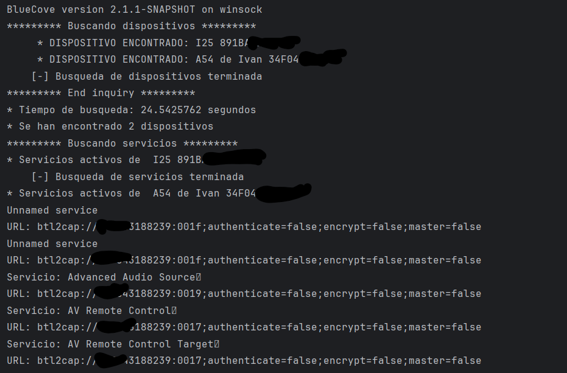
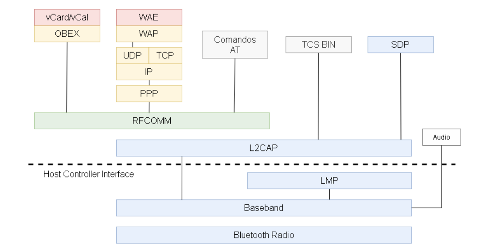
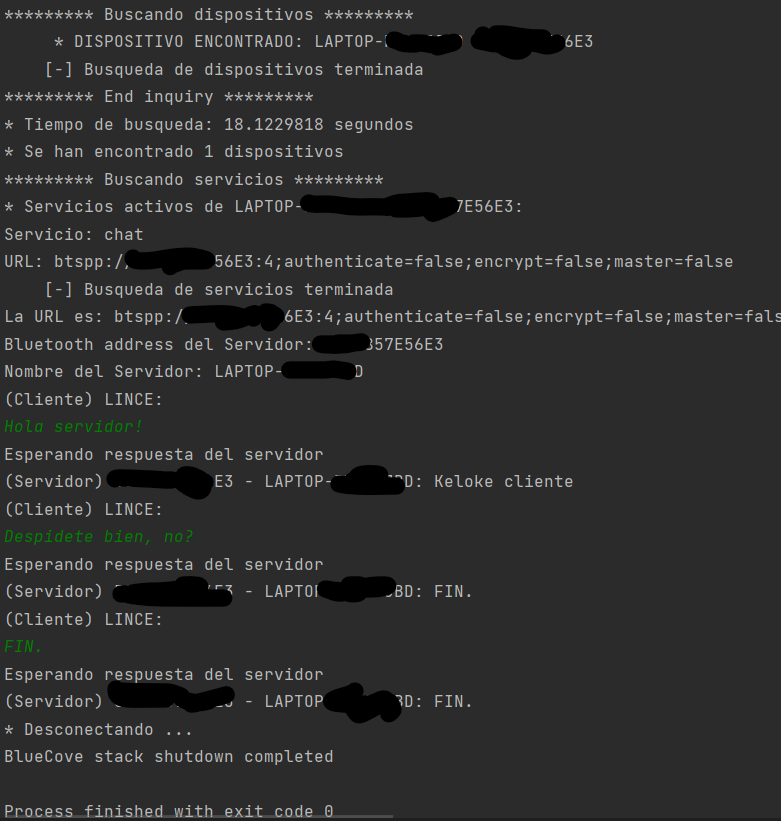
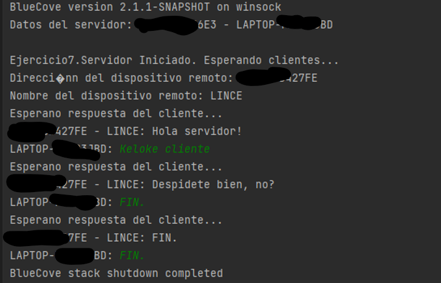

# Programacion_Bluetooth
En este repositorio se pretende enseñar algunos ejemplos de programación en Java de aplicaciones sobre Bluetooth utilizando la API BlueCove.

Cada carpeta tendrá el readme con su explicación correspondiente.

Pretendo mostrar dos ejemplos:
1. Descubrimiento de dispositivos y servicios
2. Comunicación cliente/servidor mediante Bluetooth

Los outputs esperados para estos ejemplos son los siguientes.

### Descubrimiento de servicios
Para el descubrimiento, en mi caso particular tengo lo siguiente:

En el que el programa encuentra dos dispositivos, mi teléfono y mis auriculares inalámbricos.

Para los auriculares no se encuentran servicios concretos en la foto, mientras que en el teléfono se detectan 
servicios de audio y control remoto, junto a sus URLs de conexión.

# Introducción a la pila Bluetooth

La pila de protocolos Bluetooth es esencial para la comunicación y el descubrimiento de dispositivos y servicios.

A continuación voy a introducir algunos aspectos importantes de la pila de protocolos Bluetooth para este proyecto.

La pila estructura de la pila de protocolos es la siguiente:

### Componentes clave

Los componentes clave relevantes para este proyecto son los siguientes:

1. **SDP (Service Discovery Protocol)**
    - **Función**: Permite descubrir los servicios disponibles en otros dispositivos Bluetooth.
    - **Proceso**: Utiliza PDU (Protocol Data Units) para consultas y respuestas, proporcionando información sobre servicios disponibles y parámetros de conexión.
    - **Resultado**: Devuelve la URL del servicio para establecer conexiones.

2. **L2CAP (Logical Link Control and Adaptation Protocol)**
    - **Función**: Multiplexación de datos, segmentación y reensamblaje, y manejo de calidad de servicio (QoS).
    - **Ubicación**: Actúa como capa intermedia entre niveles superiores (como SDP) y niveles inferiores (como el controlador Bluetooth).

3. **RFCOMM (Radio Frequency Communication)**
    - **Función**: Emulación de puertos serie para transmisión de datos entre dispositivos Bluetooth.
    - **Uso**: Crucial para la comunicación en aplicaciones cliente-servidor.

# Comunicación cliente/servidor mediante Bluetooth
### Punto de vista del cliente:

### Punto de vista del Servidor:

En donde se ve que se realiza una comunicación efectiva entre el cliente y el servidor.

El cliente busca mediante el DiscoveryAgent el servicio de "chat" y configura flujos de entrada y salida
para permitir dicha comunicación.

El servidor espera conexiones entrantes. Luego acepta y abre las conexiones y gestiona la comunicación mediante
más flujos de entrada y salida.

En ambos lados se intercambian mensajes hasta que se envía "FIN" para acabar la comunicación
